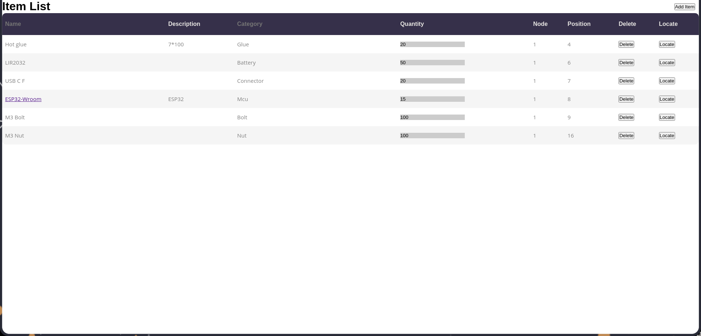
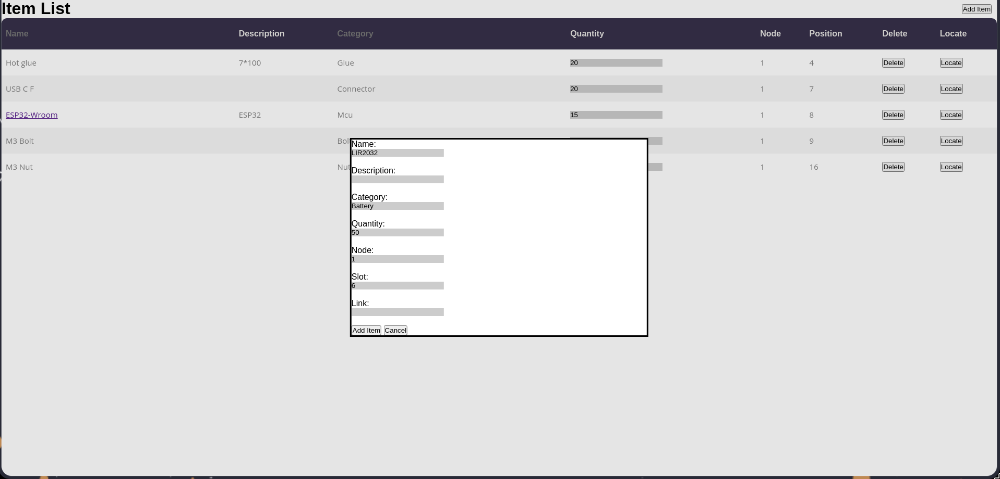

# Smart Storage System

## Overview
This is a versatile and customizable Storage System. It has the ability to combine multiple Storage Systems via the use of ESP32 (a cheap microcontroller) as controllers for the neopixels (indicators). It has a simple but useful WebUI and an API. The storage bins are compatible with Gridfinity 1x4 bins.

## Features
- [x] **Gridfinity Compatible**: Easily integrates with the Gridfinity storage system for modular storage.
- [x] **Parametric Design**: Easily customizable bins.
- [x] **ESP32 Controlled**: Scalable system using ESP32 as wireless controllers.
- [x] **Neopixels**: Dynamic lighting indicators.
- [x] **Web UI to Manage Storage**: User-friendly web interface for managing the items.
- [x] **API**: Simple to use API.

## Media
<details>
    <summary>Main Website</summary>


</details>

<details>
    <summary>Add Item Menu</summary>


</details>

<details>
    <summary>Video</summary>

[](https://cloud-f5ibtbvt0-hack-club-bot.vercel.app/0video.mp4)

</details>

## API Endpoints

### List Storage Items
- **Endpoint**: `/api/list`
- **Method**: `GET`
- **Description**: Retrieves a list of all storage items. Supports optional query parameters for filtering by category, node, and position.
- **Query Parameters**:
  - `category` (optional): Filter items by category.
  - `node` (optional): Filter items by node.
  - `position` (optional): Filter items by position.
  - `id` (optional): Filter items by ID:
### Locate Item by ID (GET)
- **Endpoint**: `/api/locateget`
- **Method**: `GET`
- **Description**: Locates an item by its ID and sends a request to the corresponding node to locate the item.
- **Query Parameters**:
  - `id` (required): The ID of the item to locate.

### List Nodes
- **Endpoint**: `/api/nodes`
- **Method**: `GET`
- **Description**:  Retrieves a list of all nodes. Supports optional query parameter for filtering by ID.
- **Query Parameters**:
    - `id` (optional): Filter nodes by ID.

### Add Storage Item
- **Endpoint**: `/api/additem`
- **Method**: `POST`
- **Description**: Adds a new storage item to the database.
- **Request Body** (JSON):
  ```json
  {
    "name": "string",
    "description": "string",
    "category": "string",
    "quantity": "integer",
    "node": "integer",
    "position": "integer",
    "url": "string",
    "slots": "array"

  }
  ```

### Add Node
- **Endpoint**: `/api/addnode`
- **Method**: `POST`
- **Description**:  Adds a new node to the database or updates an existing node if the ID already exists.
- **Request Body** (JSON):
  ```json
    {
      "id": "integer",
      "ip": "string",
      "positions": "integer"
    }
  ```

### Delete Storage Item
- **Endpoint**: `/api/delete`
- **Method**: `POST`
- **Description**:   Deletes a storage item by its ID.
- **Request Body** (JSON):
  ```json
    {
      "id": "integer"
    }
  ```

### Edit Storage Item
- **Endpoint**: `/api/edit`
- **Method**: `POST`
- **Description**:  Edits an existing storage item by its ID.
- **Request Body** (JSON):
  ```json
    {
    "id": "integer",
    "name": "string",
    "description": "string",
    "category": "string",
    "quantity": "integer",
    "node": "integer",
    "position": "integer",
    "url": "string",
    "slots": "array"
    }   
  ```

### Move Storage Item
- **Endpoint**: `/api/move`
- **Method**: `POST`
- **Description**:  Moves a storage item to a different node and position.
- **Request Body** (JSON):
  ```json
    {
    "id": "integer",
    "node": "integer",
    "position": "integer"
    }
  ```

### Locate Item by ID (POST)
- **Endpoint**: `/api/locate`
- **Method**: `POST`
- **Description**:  Locates an item by its ID and sends a request to the corresponding node to locate the item.
- **Request Body** (JSON):
  ```json
    {
    "id": "integer"
    }
  ```


## Getting Started

### Prerequisites
- [PlatformIO](https://platformio.org) installed on your development environment.
- ESP32 DevBoard or Controller PCB (WIP).
- Neopixels (WS2812B) or [Indicator PCB](https://github.com/Pegoku/StorageSystem/tree/master/PCB/Indicators).
- Some wire.

### API 
1. Clone the repository:
    ```sh
    git clone https://github.com/Pegoku/StorageSystem.git
    cd StorageSystem/Code/Server
    ```
2. Create a Python virtual environment and install the requirements:
    ```sh
    python3 -m venv .venv
    source .venv/bin/activate
    pip install -r requirements.txt
    ```
3. Run the main Python file:
    ```sh
    python3 main.py
    ```

### API (Docker)
1. Clone the repository:
  ```sh
  git clone https://github.com/Pegoku/StorageSystem.git
  cd StorageSystem
  ```
2. Build and run the Docker container:
  ```sh
  docker buildx build -t storagesystem:server -f server.Dockerfile .
  docker run -p 5000:5000 -v ./database.db:/app/database.db storagesystem:server
  ```
3. The API should now be running and accessible at `http://localhost:5000`.


### ESP32
1. Clone the repository:
    ```sh
    git clone https://github.com/Pegoku/StorageSystem.git
    cd StorageSystem
    ```
2. Install the required libraries and dependencies:
    ```sh
    platformio run
    ```
3. Connect your ESP32 to your computer.
4. Edit the `include/.env.template` file and rename it to `include/.env`.
5. Upload the firmware to the ESP32:
    ```sh
    platformio run --target upload
    ```
6. Open the serial monitor to check if the installation was successful:
    ```sh
    platformio device monitor
    ```

### Website
1. Clone the repository:
    ```sh
    git clone https://github.com/Pegoku/StorageSystem.git
    cd StorageSystem/Code/App
    ```
2. Create a Python virtual environment and install the requirements:
    ```sh
    python3 -m venv .venv
    source .venv/bin/activate
    pip install -r requirements.txt
    ```
3. Run the main Python file:
    ```sh
    python3 main.py
    ```

### Website (Docker)
1. Clone the repository:
  ```sh
  git clone https://github.com/Pegoku/StorageSystem.git
  cd StorageSystem
  ```
2. Build and run the Docker container:
  ```sh
  docker buildx build -t storagesystem:app -f app.Dockerfile .
  docker run -p 5001:5001 storagesystem:app
  ```
3. The website should now be running and accessible at `http://localhost:5001`.

## Contributing
Contributions are welcome! Please fork the repository and submit a pull request with your changes.